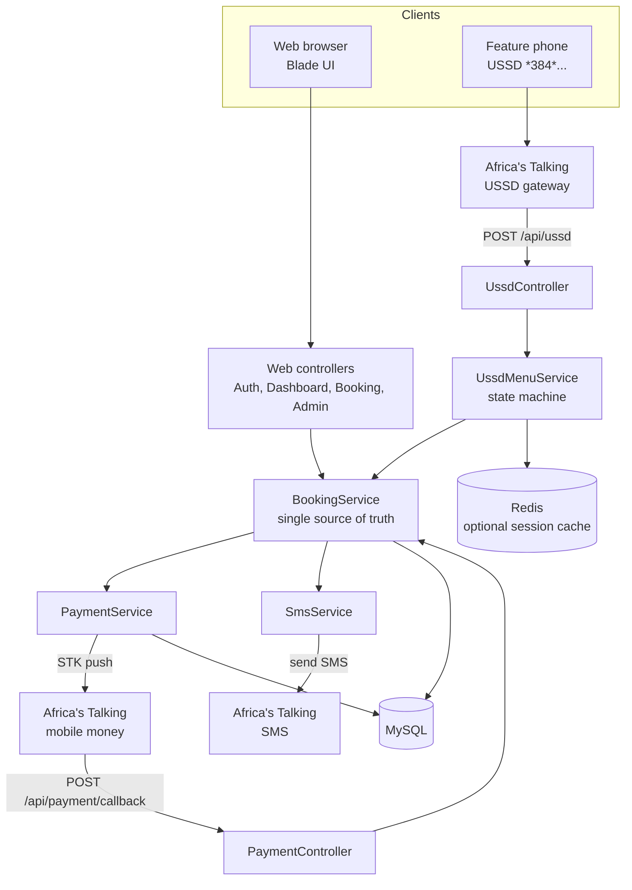
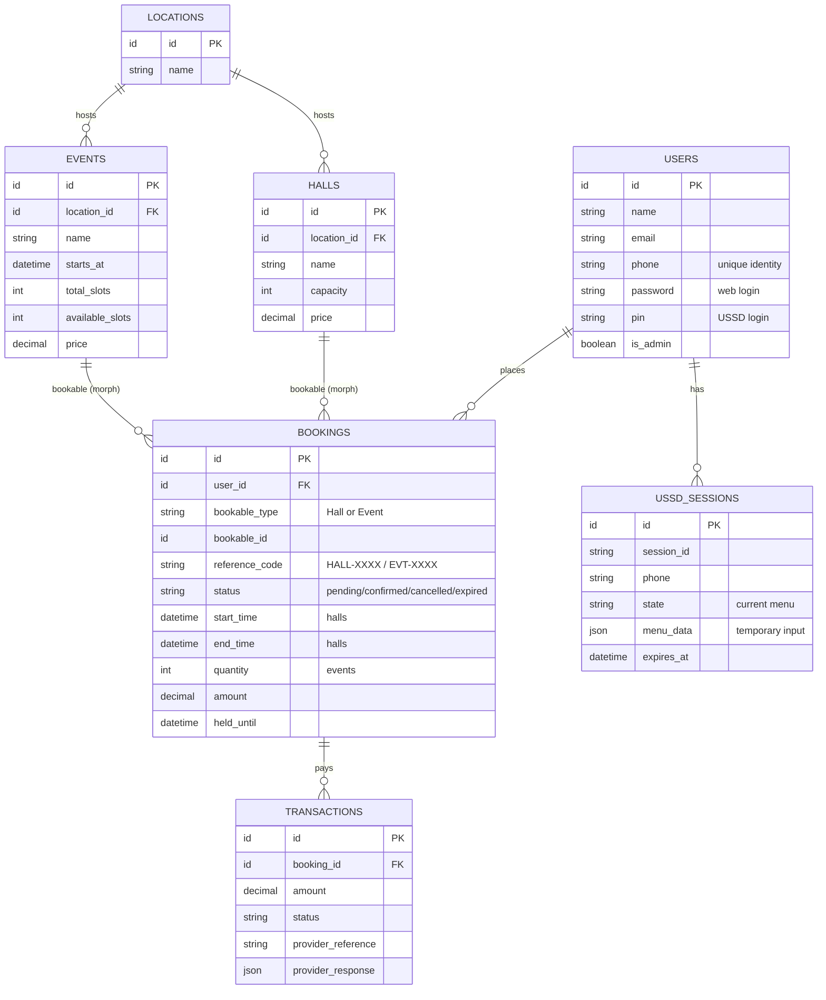
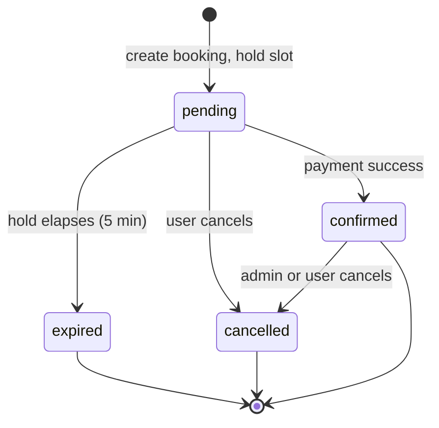
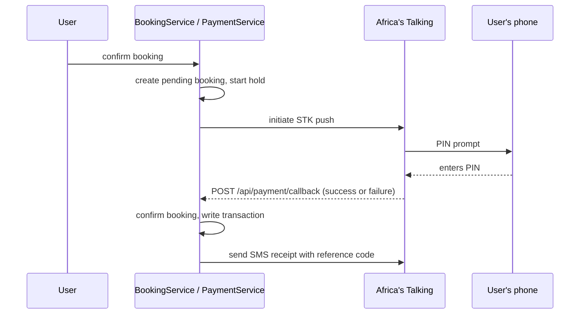
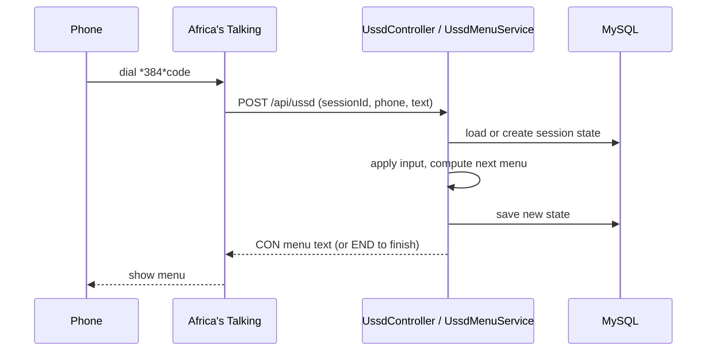

<div align="center">

# Community Booking System

### Hybrid Web and USSD platform for booking community halls and event tickets, with mobile money payment and SMS confirmation

Book from a browser or from any basic phone over USSD, against one shared backend, one set of rules, and one database.


<br/>

[](#-features)
[](#-system-architecture)
[](#-database-schema)
[](#-installation)
[](#-ussd-experience)

</div>

---

## Table of contents

1. [Overview](#-overview)
2. [Features](#-features)
3. [Screenshots](#-screenshots)
4. [Tech stack](#-tech-stack)
5. [System architecture](#-system-architecture)
6. [Database schema](#-database-schema)
7. [Core workflows](#-core-workflows)
8. [The USSD experience](#-ussd-experience)
9. [Project structure](#-project-structure)
10. [Routes and endpoints](#-routes-and-endpoints)
11. [Requirements](#-requirements)
12. [Installation](#-installation)
13. [Configuration](#-configuration)
14. [Running USSD and payments locally](#-running-ussd-and-payments-locally)
15. [Usage guide](#-usage-guide)
16. [Testing](#-testing)
17. [Roadmap](#-roadmap)
18. [License and author](#-license-and-author)

---

## Overview

The Community Booking System lets a community centre publish two kinds of bookable resource, halls that are reserved by time window and events that are sold by ticket quantity, and lets the public book them either on the web or over USSD on a feature phone. Payment is by mobile money, and a confirmation with a reference code is sent by SMS.

The design goal is that the browser and the USSD session are not two applications. Both call the same service layer, so a booking made by a smartphone user and a booking made from a basic handset are the same record, follow the same lifecycle, and obey the same availability and payment rules. The engineering worth reading is underneath the two front ends: preventing double booking under concurrency, holding a reservation while payment settles, and running a USSD menu as a server side state machine.

---

## Features

| Area | What it does |
|------|--------------|
| Public browsing | View available halls and events with no account. |
| Hybrid accounts | One identity per phone number. Web signs in with email and password; USSD recognises the phone number and a PIN. |
| Hall booking | Reserve a hall for a time window with start and end times. |
| Event booking | Buy a quantity of tickets against a fixed pool of slots. |
| Reservation hold | A new booking is held as pending for a grace period, five minutes by default, while payment completes. |
| Mobile money payment | STK push through Africa's Talking with an asynchronous success or failure callback. |
| SMS notifications | Confirmations with reference codes, payment receipts, and booking history over SMS. |
| USSD interface | Register, browse, book, and view history from any phone, with paginated menus and input validation. |
| Admin panel | Manage halls, events, bookings, users, and locations behind an admin gate. |
| Audit trail | Every payment attempt is stored with the provider response. |

---

## Screenshots

> Add screenshots to `docs/screenshots/` and they will render here.

| Home | Booking flow | Admin dashboard |
|------|--------------|-----------------|
| `docs/screenshots/home.png` | `docs/screenshots/booking.png` | `docs/screenshots/admin.png` |

---

## Tech stack

| Layer | Technology |
|-------|-----------|
| Language | PHP 8.2 |
| Framework | Laravel 11 |
| Views | Blade server rendered templates |
| Database | MySQL 8 |
| Cache and USSD sessions | Redis, optional, via Predis |
| USSD, SMS, mobile money | Africa's Talking PHP SDK |
| Tooling | Composer, Laravel Pint, PHPUnit, Mockery, Laravel Sail |

---

## System architecture

Two front ends, one brain. Controllers and the USSD menu service are thin adapters; all booking rules live in `BookingService`.



---

## Database schema

Six core tables, normalised to third normal form, plus a locations reference. Bookings are polymorphic: one table holds both hall and event bookings and points at its resource through `bookable_type` and `bookable_id`.



> The attributes above are the logical model. Exact column names live in `database/migrations`.

---

## Core workflows

### Booking lifecycle

A booking is created as `pending` and holds its slot. Payment moves it to `confirmed`; the hold elapsing moves it to `expired`; the user backing out moves it to `cancelled`. Confirmed is the only state that keeps the resource reserved for good.



### Payment flow

Payment is asynchronous. The app initiates an STK push and returns; the outcome arrives later on a callback that confirms or fails the booking.



### Concurrency and the reservation hold

Availability is checked and the booking is written inside one database transaction that locks the relevant rows with `lockForUpdate`, backed by composite indexes on the overlap check. Two requests for the same hall slot cannot both win; one waits and then sees the slot is taken. The reservation hold means a slot is not surrendered the instant a booking is made, but it is also not held forever: a scheduled task expires stale pending bookings after `BOOKING_HOLD_MINUTES` and releases their slots.

---

## USSD experience

USSD is stateless per request, so each session's menu position and in progress input are kept in a `ussd_sessions` row, with a JSON field for temporary values and a timeout aligned to the mobile operator's own limit. The menu is a state machine driven by the stored position and the latest keypress.



Typical menu tree:

```
Main Menu
 1. Book a Hall
    -> pick location -> pick hall -> pick date/time -> confirm -> pay
 2. Book an Event
    -> pick event -> choose quantity -> confirm -> pay
 3. My Bookings
    -> paginated list with reference codes and status
 4. Register / Set PIN
```

---

## Project structure

```
Booking-system/
├── app/
│   ├── Http/Controllers/
│   │   ├── Web/          # AuthController, DashboardController, BookingController, AdminController
│   │   └── Api/          # UssdController, PaymentController (webhooks)
│   ├── Models/           # User, Hall, Event, Booking, Transaction, UssdSession
│   ├── Services/         # BookingService, PaymentService, SmsService, UssdMenuService
│   └── Traits/           # GeneratesReferenceCode (HALL-XXXX, EVT-XXXX)
├── database/
│   ├── migrations/       # users, halls, events, bookings, transactions, ussd_sessions
│   ├── factories/
│   └── seeders/
├── resources/views/      # Blade templates for public, user, and admin
├── routes/
│   ├── web.php           # public, auth, user, and admin routes
│   └── api.php           # USSD and payment webhooks
├── config/
├── public/
├── docs/                 # diagrams and documentation
├── Dockerfile
├── setup.bat             # Windows one-shot setup
├── run-migrations.bat
├── start-server.bat
├── simulate-payment.bat  # posts a fake payment callback for testing
└── composer.json
```

---

## Routes and endpoints

### Public

| Method | URI | Purpose |
|--------|-----|---------|
| GET | `/` | Home page |
| GET | `/halls` | Browse halls |
| GET | `/halls/{id}` | Hall detail |
| GET | `/events` | Browse events |
| GET | `/events/{id}` | Event detail |
| GET, POST | `/login`, `/register`, `/logout` | Authentication |

### Authenticated user

| Method | URI | Purpose |
|--------|-----|---------|
| GET | `/dashboard` | User dashboard |
| GET | `/my-bookings` | Booking history |
| GET, POST | `/bookings/hall/{hallId}/create`, `/bookings/hall` | Create and store a hall booking |
| GET, POST | `/bookings/event/{eventId}/create`, `/bookings/event` | Create and store an event booking |
| GET | `/bookings/{id}/confirmation` | Booking confirmation |
| DELETE | `/bookings/{id}` | Cancel a booking |
| POST | `/api/check-hall-availability`, `/api/check-event-availability` | Live availability checks |

### Admin (behind `auth` and `admin` middleware, prefix `/admin`)

| Resource | Capabilities |
|----------|--------------|
| Halls | list, create, edit, update, delete |
| Events | list, create, edit, update, delete |
| Bookings | list, edit, update, delete |
| Users | list, edit, update |
| Locations | list, create, edit, update, delete |

### Webhooks (called by Africa's Talking, no auth)

| Method | URI | Purpose |
|--------|-----|---------|
| POST | `/api/ussd` | USSD gateway callback |
| POST | `/api/payment/callback` | Mobile money result |
| GET | `/api/payment/status` | Payment status check |

---

## Requirements

- PHP 8.2 or newer
- Composer
- MySQL 8
- Redis, optional, for USSD session caching
- An Africa's Talking account (sandbox is fine for testing)
- ngrok or another tunnel so the provider can reach your webhooks

---

## Installation

```bash
git clone https://github.com/Diyoh/Booking-system.git
cd Booking-system

composer install
cp .env.example .env
php artisan key:generate
```

Create a MySQL database named `booking_system`, set `DB_USERNAME` and `DB_PASSWORD` in `.env`, then:

```bash
php artisan migrate --seed
php artisan serve
```

Open `http://localhost:8000`.

On Windows the helper scripts run the same steps: `setup.bat` for first time setup, then `run-migrations.bat` and `start-server.bat`.

### Docker

A `Dockerfile` is included for a containerised build, and Laravel Sail is available for a full local stack:

```bash
./vendor/bin/sail up
```

---

## Configuration

Set these in `.env`:

| Variable | Meaning | Example |
|----------|---------|---------|
| `APP_NAME` | Application name | `Community Booking System` |
| `DB_DATABASE` | MySQL database | `booking_system` |
| `AT_USERNAME` | Africa's Talking username | `sandbox` |
| `AT_API_KEY` | Africa's Talking API key | `your_key` |
| `AT_SENDER_ID` | SMS sender id | `BOOKING` |
| `AT_ENVIRONMENT` | `sandbox` or `production` | `sandbox` |
| `NGROK_URL` | Public tunnel for webhooks | `https://xxx.ngrok.io` |
| `BOOKING_HOLD_MINUTES` | Reservation hold length | `5` |
| `USSD_SESSION_TIMEOUT` | USSD session timeout in seconds | `180` |

---

## Running USSD and payments locally

1. Start the app: `php artisan serve`.
2. Expose it: `ngrok http 8000`, and put the URL in `NGROK_URL`.
3. In the Africa's Talking dashboard, point the USSD callback at `NGROK_URL/api/ussd` and the payment callback at `NGROK_URL/api/payment/callback`.
4. Dial your USSD code in the Africa's Talking simulator to walk the menus.
5. To exercise the payment confirmation path without a live transaction, run `simulate-payment.bat`, which posts a callback exactly as the provider would.

---

## Usage guide

### As a web user

Register or log in, browse halls or events, pick a hall time window or a number of event tickets, confirm to create a pending booking, complete the mobile money prompt, and receive an SMS confirmation with a reference code. Cancel from the bookings page while a booking still allows it.

### As a USSD user

Dial the USSD code, register a PIN on first use, then browse and book through the numbered menus. The same booking rules and the same SMS confirmation apply.

### As an administrator

Sign in with an admin account and open `/admin`. Create and edit halls, events, and locations, review and adjust bookings, and manage users.

---

## Testing

```bash
php artisan test
```

PHPUnit and Mockery are configured, and Faker is available for factories and seeders.

---

## Roadmap

- Seed data for demo halls, events, and an admin account
- Automated tests around the booking and USSD flows
- Richer admin reporting and export
- Email notifications alongside SMS

---

## License and author

Released under the MIT License. See [LICENSE](LICENSE).

Built by **Diyoh Shiloh** .

<div align="center">

If this project helped you, consider giving it a star.

</div>
